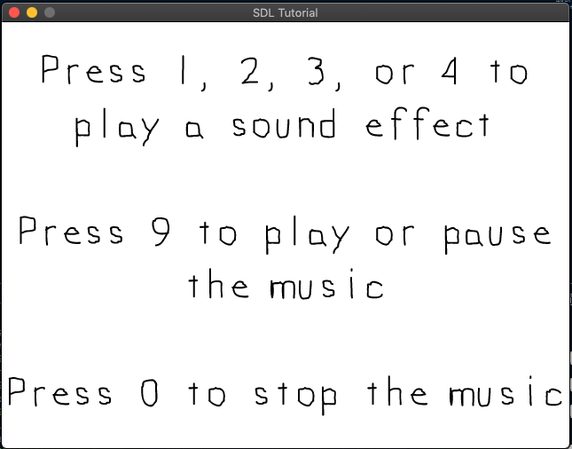

# LazyFoo SDL2 Mixer Demo

## Description

This project is a simple demo to test functionality of [SDL2](https://www.libsdl.org) Mixer taken directly from [Lazy Foo: Lesson 21 - Sound Effects and Music](https://lazyfoo.net/tutorials/SDL/21_sound_effects_and_music/index.php).  Note this example was modified slightly to use `SDL2`.

## Building

### Mac OS X 

*Requirements:*
- XCode Build Tools - `clang++`, `make`
- [homebrew](https://brew.sh/)
- use homebrew to install SDL2, SDL2_image, SDL2_mixer 

```bash
brew install sdl2 sdl2_image sdl2_mixer
```

*Instructions:*

```bash
make
```

run the _main_ binary as follows
```bash
./main
```

*expected results:*

you should see a window as follows



## Reference
- [SDL2 Wiki - Audio Category](http://wiki.libsdl.org/CategoryAudio)
- [Lazy Foo Tutorials](https://lazyfoo.net/tutorials)
- [Lazy Foo: Lesson 21 - Sound Effects and Music](https://lazyfoo.net/tutorials/SDL/21_sound_effects_and_music/index.php)
- [SDL_image Documentation](https://www.libsdl.org/projects/SDL_image/docs/index.html)
- [SDL_mixer Documentation](https://www.libsdl.org/projects/SDL_mixer/docs/index.html)
- [SDL](https://www.libsdl.org)